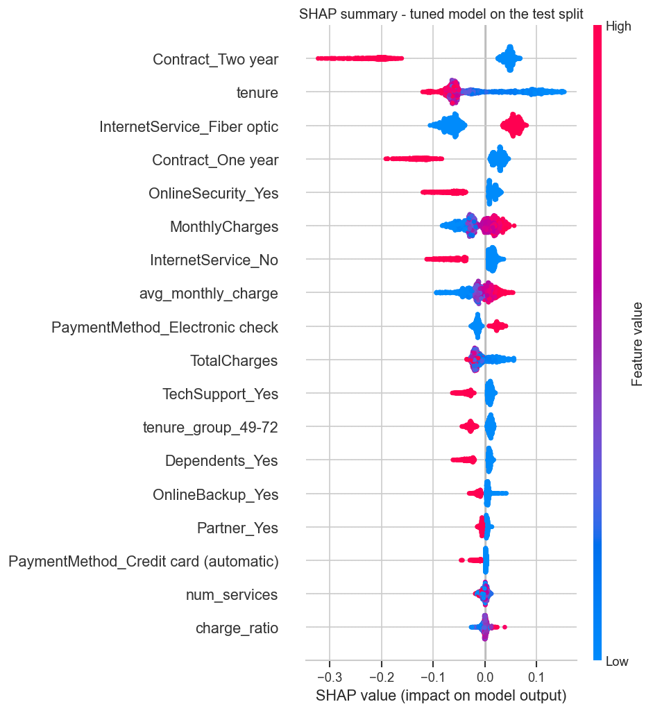
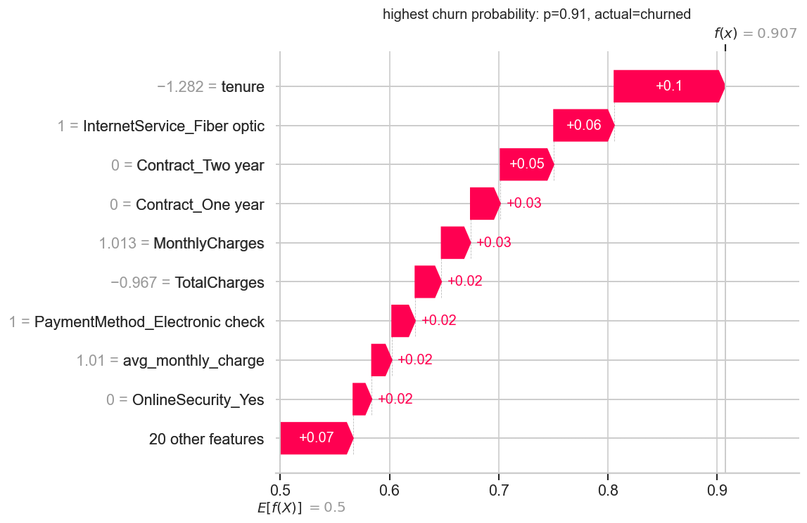
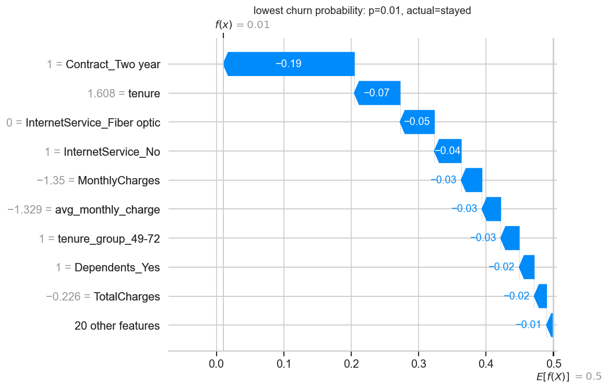

# Telco Customer Churn Prediction

An end-to-end churn model for a telecom customer base: cleaning and exploring the IBM Telco
dataset, engineering features, comparing four classifiers under stratified cross-validation,
tuning the winner, explaining its predictions with SHAP, and putting it behind a small Streamlit
app that scores single customers or a whole CSV and shows what drove each score.

## Why I built this

Churn is the classic tabular classification problem, and I wanted a project that goes past
"train a model in a notebook" to the things that actually matter when a model is used: an
imbalanced target, a decision threshold the business can move, an explanation for every score,
and a scoring UI a retention analyst could use without touching Python. Everything reusable lives
in `src/` and is shared between the notebooks and the app.

## Dataset

[IBM Telco Customer Churn](https://raw.githubusercontent.com/IBM/telco-customer-churn-on-icp4d/master/data/Telco-Customer-Churn.csv)
(also on Kaggle) - 7,043 customers, 20 attributes and a `Churn` label. 26.5% of customers
churned. The raw CSV is committed under `data/raw/` and `data/README.md` records its source.

| Group | Columns |
|---|---|
| Demographics | gender, SeniorCitizen, Partner, Dependents |
| Account | tenure, Contract, PaperlessBilling, PaymentMethod, MonthlyCharges, TotalCharges |
| Services | PhoneService, MultipleLines, InternetService, OnlineSecurity, OnlineBackup, DeviceProtection, TechSupport, StreamingTV, StreamingMovies |

## Project layout

```
data/raw/                     the untouched CSV
data/processed/               telco_clean.csv (output of notebook 01)
notebooks/
  01_data_cleaning.ipynb      types, duplicates, outliers, target balance
  02_eda.ipynb                univariate / bivariate analysis, correlation matrix
  03_feature_engineering.ipynb derived features, train/test split, encoding, mutual information
  04_modelling.ipynb          pipeline CV comparison, tuning, one pass over the test split
  05_explainability.ipynb     SHAP global + local explanations, permutation importance
src/
  data.py                     load / clean helpers
  features.py                 derived columns and the encoding + scaling ColumnTransformer
  train.py                    model zoo, imblearn pipelines, CV comparison, random search
  metrics.py                 metrics and diagnostic plots
  explain.py                  SHAP helpers shared by notebook 05 and the app
app/streamlit_app.py          scoring UI
models/                       churn_pipeline.joblib (preprocessor + model), feature list
reports/figures/              every plot referenced below
reports/metrics.json          numbers the app and this README quote
tests/                        pytest suite for the cleaning rules, features and scoring path
data/sample_customers.csv     40 real customers for the batch page and the tests
```

## Approach

1. **Cleaning** (`01`) - parse `TotalCharges` to numeric (its eleven blanks are single spaces
   that `isna()` misses; they are all first-month customers and become 0 explicitly), normalise
   `SeniorCitizen` to Yes/No, collapse the redundant `No internet service` levels, check
   duplicates and IQR outliers.
2. **EDA** (`02`) - churn rate by every categorical, distributions of tenure and charges, a
   correlation matrix, and written conclusions under each plot.
3. **Feature engineering** (`03`) - `avg_monthly_charge`, `charge_ratio`, `num_services` and
   `tenure_group`; a stratified 80/20 split *before* anything is fitted; a `ColumnTransformer`
   (one-hot + standard scaling) fit on the training rows; mutual-information ranking.
4. **Modelling** (`04`) - every model is an imbalanced-learn pipeline
   `preprocessor -> SMOTE -> classifier`, so resampling and scaling happen inside each CV fold.
   Logistic Regression vs Random Forest vs XGBoost vs LightGBM under stratified 5-fold CV,
   `RandomizedSearchCV` on the training split for the best family, then a single scoring pass over
   the untouched 20%, plus a threshold sweep.
5. **Explainability** (`05`) - SHAP summary, dependence and waterfall plots for the tuned model,
   cross-checked with permutation importance.
6. **App** - Streamlit UI with a single-customer form, batch CSV scoring, SHAP contributions for
   every score, a threshold slider, a performance page and a locked model-management page.

## EDA insights


Contract type is the strongest single signal: month-to-month customers churn at 42.7%, one-year
at 11.3% and two-year at 2.8%. Electronic-check payers churn at 45.3% against 15-17% for the two
automatic payment methods.


Churn concentrates in the top-left of this plot - short tenure and a high monthly bill. Churners
have a median tenure of 10 months (vs 38) and a median monthly charge of $80 (vs $64).


Fiber optic customers churn at 41.9% against 19.0% on DSL. The protective add-ons matter
(customers without OnlineSecurity or TechSupport churn at ~40%, with them ~15%); the streaming
add-ons barely move the rate.


47% of first-year customers churn; under 10% do after four years. Retention effort pays off most
in the first twelve months.


`tenure` and `TotalCharges` are collinear (0.83), which is why the feature step derives an
average monthly charge instead of leaning on both. Against the target, tenure is the strongest
linear signal (-0.35).

Two things the EDA settled for the modelling: the target is 26.5% positive, so accuracy alone
would flatter a model that never predicts churn, and the "first twelve months" effect is a step,
not a slope, which favours tree models or an explicit tenure bucket.

## Model comparison

Stratified 5-fold cross-validation on the 5,634 training rows (means over folds; SMOTE and the
scaler are refit inside every fold, the validation fold is real data):

| Model | Accuracy | Precision | Recall | F1 | ROC-AUC |
|---|---|---|---|---|---|
| Logistic Regression | 0.7691 | 0.5512 | 0.7037 | 0.6181 | 0.8346 |
| **Random Forest** | 0.7772 | 0.5626 | **0.7184** | **0.6307** | **0.8395** |
| XGBoost | 0.7767 | 0.5636 | 0.7010 | 0.6247 | 0.8369 |
| LightGBM | **0.7835** | **0.5788** | 0.6749 | 0.6229 | 0.8344 |

Held-out test split (1,409 customers, never resampled, scored once), default threshold 0.5:

| Model | Accuracy | Precision | Recall | F1 | ROC-AUC | PR-AUC |
|---|---|---|---|---|---|---|
| Logistic Regression | 0.7679 | 0.5493 | 0.7005 | 0.6157 | 0.8344 | 0.6336 |
| Random Forest | 0.7693 | 0.5499 | 0.7219 | 0.6243 | 0.8381 | 0.6376 |
| XGBoost | 0.7693 | 0.5520 | 0.6952 | 0.6154 | 0.8327 | 0.6427 |
| LightGBM | 0.7835 | 0.5762 | 0.6979 | 0.6312 | 0.8329 | 0.6389 |
| **Random Forest (tuned)** | 0.7573 | 0.5288 | **0.7861** | **0.6323** | **0.8424** | **0.6509** |


Why these numbers and not higher: with SMOTE applied only to the training folds and a test set
that is 26.5% churners like the real base, ~0.84 ROC-AUC and ~0.63 F1 is what this dataset
supports. Accuracy in the high 70s sounds worse than the 73% you get by predicting "stays" for
everyone, but that trivial model has zero recall; these catch 70-79% of churners.

### Chosen model

**Random Forest**, tuned by random search (`n_estimators=200, max_depth=6, max_features=0.3,
min_samples_leaf=2`; CV ROC-AUC 0.8439). The four families sit within a fold's standard
deviation (~0.01) of each other on ROC-AUC, so the pick came down to recall - the metric a
retention campaign is paid on - where the forest leads at every threshold I looked at, and to
cheap exact SHAP values from `TreeExplainer`. Tuning pushed it towards a shallower, more
regularised forest that trades a few points of precision for +6 points of recall. Logistic
regression is 0.8 points of AUC behind and would be the pick if the raw coefficients had to be
presented to a non-technical audience.

The threshold sweep (`reports/figures/16_threshold_sweep.png`) shows F1 peaking at the default
0.5 (precision 0.53, recall 0.79). Dropping the cut-off to 0.35 lifts recall to 0.90 at a
precision of 0.44 - one real churner for every 2.3 customers contacted. The app exposes the
threshold as a slider so a retention team can pick the point that matches their capacity.

## Explainability

`05_explainability.ipynb` computes exact SHAP values for the tuned forest on the test split.



Contract type is the biggest lever - a two-year contract pulls a customer's churn probability
down by up to 0.3, a one-year by ~0.2 - followed by tenure, the fiber optic flag (which pushes
*towards* churn for every customer that has it) and the `OnlineSecurity` add-on. The charge
columns come next; gender, phone service, the streaming add-ons and my `charge_ratio` feature
barely register. The dependence plot for tenure (`20_shap_dependence.png`) shows the effect is a
step through the first year and flat afterwards, exactly the pattern the EDA found.

| Customer the model is surest will churn | Surest will stay |
|---|---|
|  |  |

Permutation importance on the raw columns (`22_permutation_importance.png`) agrees on the top
three - contract, internet service, tenure - and shows the bottom half of the features could be
dropped for less than half a point of ROC-AUC.

The app computes the same per-feature contributions (`src/explain.py`) for every customer it
scores: a bar chart on the single-customer page and a `top_drivers` column in batch results.

## Running it

```bash
python3.12 -m venv .venv && source .venv/bin/activate
pip install -r requirements.txt
cp .env.example .env            # optional: set CHURN_ADMIN_PASSWORD to unlock model management

# reproduce everything (each notebook writes the inputs the next one reads; ~5 minutes)
jupyter nbconvert --execute --to notebook --inplace notebooks/0*.ipynb

# start the app
streamlit run app/streamlit_app.py --server.port 8531
```

The saved pipeline and figures are committed, so the app runs without re-executing the
notebooks. It has four pages: **Score a customer** (form + SHAP contributions), **Batch scoring**
(upload a CSV with the raw Telco columns - `data/sample_customers.csv` is a ready-made one),
**Model performance** (the tables above plus the EDA takeaways) and **Model management** (shows
the live model file and switches between pipelines deployed under `models/`; locked unless
`CHURN_ADMIN_PASSWORD` is set).

## Testing

```bash
pytest
```

Fourteen tests under `tests/` run against forty real customers from `data/sample_customers.csv`
and the committed pipeline: the blank-`TotalCharges` rules, the derived-feature arithmetic, stable
preprocessor column order (including unseen category levels), probability sanity on a known
high-risk and low-risk profile, batch/single agreement, and SHAP contributions summing to the
predicted probability.

## Screenshots

| Single customer | Batch scoring |
|---|---|
|  |  |

## Roadmap

- Calibrate the probabilities (Platt / isotonic) so the score reads as a real likelihood - SMOTE
  shifts the base rate to 50%, so today's 0.5 is a ranking cut-off rather than a true 50% chance.
- Add a cost-based threshold picker: expected retention offer cost vs expected lost revenue.
- Track drift on incoming batches against the training distribution.
