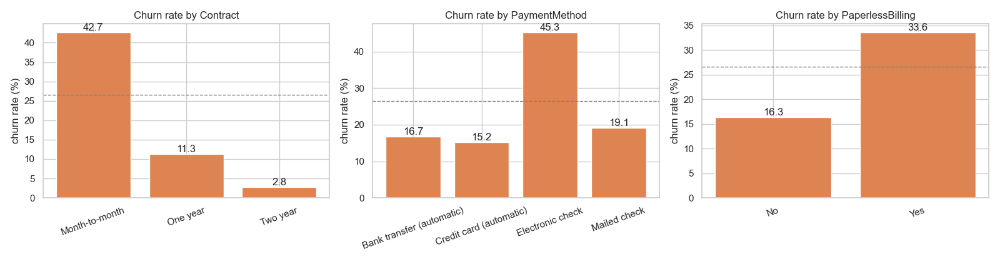
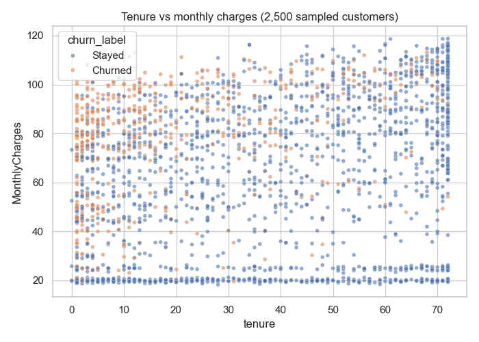
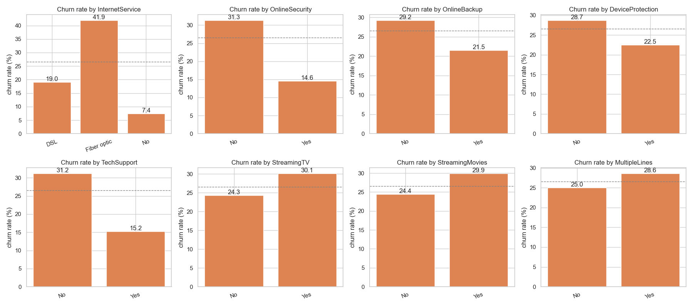
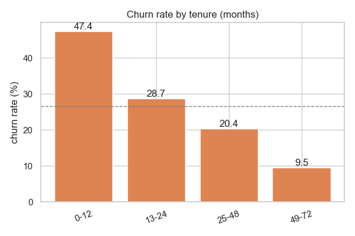
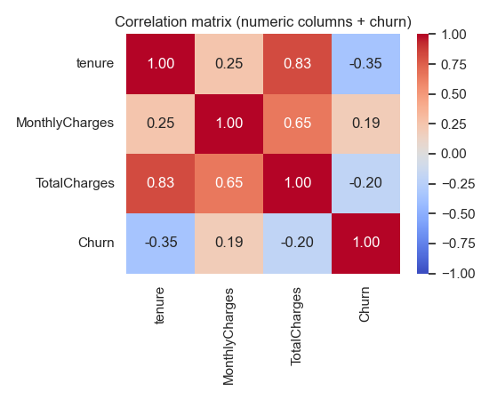
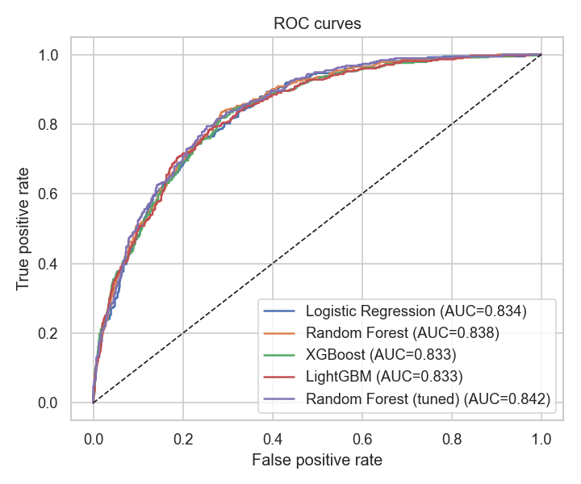
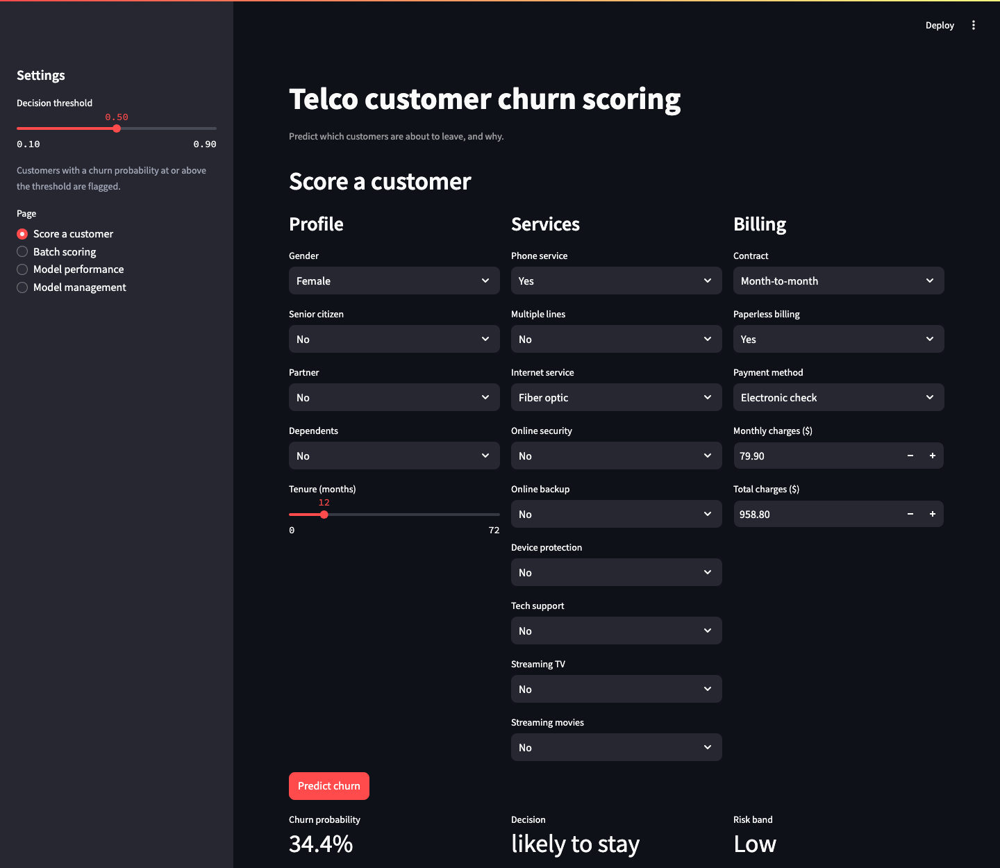
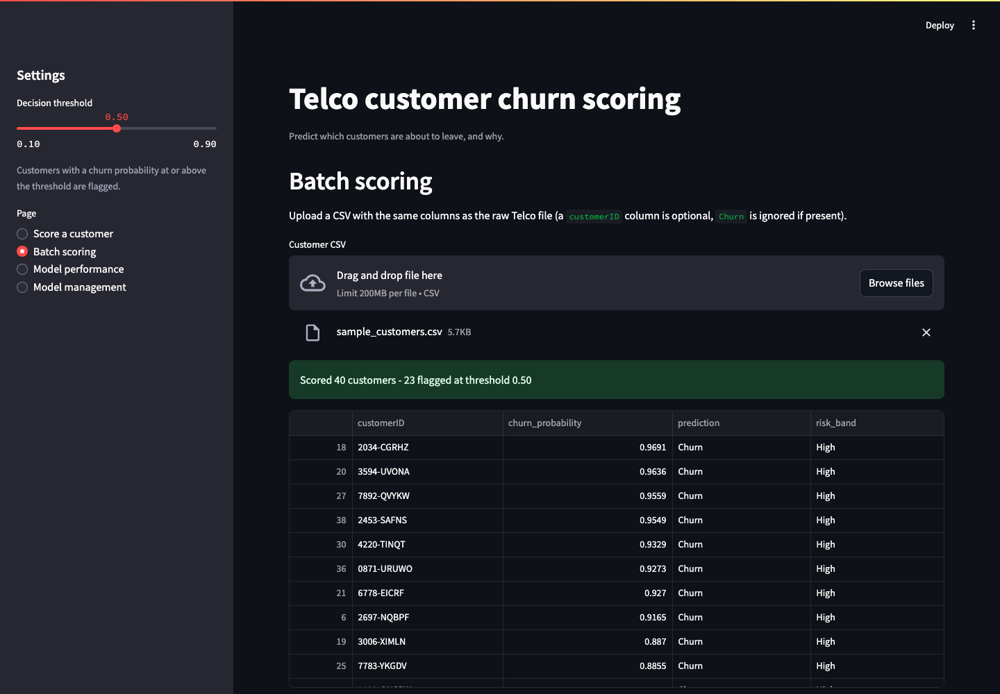

# Telco Customer Churn Prediction

An end-to-end churn model for a telecom customer base: cleaning and exploring the IBM Telco
dataset, engineering features, comparing four classifiers under stratified cross-validation,
tuning the winner, explaining its predictions with SHAP, and putting it behind a small Streamlit
app that scores single customers or a whole CSV.

## Why I built this

Churn is the classic tabular classification problem, and I wanted a project that goes past
"train a model in a notebook" to the things that actually matter when a model is used: an
imbalanced target, a decision threshold the business can move, an explanation for every score,
and a scoring UI a retention analyst could use without touching Python. Everything reusable lives
in `src/` and is shared between the notebooks and the app.

## Dataset

[IBM Telco Customer Churn](https://raw.githubusercontent.com/IBM/telco-customer-churn-on-icp4d/master/data/Telco-Customer-Churn.csv)
(also on Kaggle) - 7,043 customers, 20 attributes and a `Churn` label. 26.5% of customers
churned. The raw CSV is committed under `data/raw/` and `data/README.md` records its source.

| Group | Columns |
|---|---|
| Demographics | gender, SeniorCitizen, Partner, Dependents |
| Account | tenure, Contract, PaperlessBilling, PaymentMethod, MonthlyCharges, TotalCharges |
| Services | PhoneService, MultipleLines, InternetService, OnlineSecurity, OnlineBackup, DeviceProtection, TechSupport, StreamingTV, StreamingMovies |

## Project layout

```
data/raw/                     the untouched CSV
data/processed/               telco_clean.csv (output of notebook 01)
notebooks/
  01_data_cleaning.ipynb      types, duplicates, outliers, target balance
  02_eda.ipynb                univariate / bivariate analysis, correlation matrix
  03_feature_engineering.ipynb derived features, encoding, mutual information
  04_modelling.ipynb          SMOTE, 5-fold CV comparison, tuning, test-split results
  05_explainability.ipynb     SHAP global + local explanations of the final model
src/
  data.py                     load / clean helpers
  features.py                 derived columns, encoding + scaling
  train.py                    model zoo, cross-validated comparison, random search
  metrics.py                 metrics and diagnostic plots
app/streamlit_app.py          scoring UI
models/                       saved model, scaler and feature list
reports/figures/              every plot referenced below
reports/metrics.json          numbers the app and this README quote
tests/                        pytest suite for the feature pipeline and scoring path
```

## Approach

1. **Cleaning** (`01`) - parse `TotalCharges` to numeric, normalise `SeniorCitizen` to Yes/No,
   collapse the redundant `No internet service` levels, check duplicates and IQR outliers.
2. **EDA** (`02`) - churn rate by every categorical, distributions of tenure and charges, a
   correlation matrix, and written conclusions under each plot.
3. **Feature engineering** (`03`) - `avg_monthly_charge`, `charge_ratio`, `num_services` and
   `tenure_group`; one-hot encoding and standard scaling; mutual-information ranking.
4. **Modelling** (`04`) - SMOTE for the imbalance, Logistic Regression vs Random Forest vs XGBoost
   vs LightGBM under stratified 5-fold CV, random-search tuning of the best family, scoring on
   a held-out 20% split, threshold sweep.
5. **Explainability** (`05`) - SHAP summary and dependence plots for the tuned model, plus local
   explanations for individual customers.
6. **App** - Streamlit UI with a single-customer form, batch CSV scoring, a threshold slider and a
   performance page.

## EDA insights



Contract type is the strongest single signal: month-to-month customers churn at 42.7%, one-year
at 11.3% and two-year at 2.8%. Electronic-check payers churn at 45.3% against 15-17% for the two
automatic payment methods.



Churn concentrates in the top-left of this plot - short tenure and a high monthly bill. Churners
have a median tenure of 10 months (vs 38) and a median monthly charge of $80 (vs $64).



Fiber optic customers churn at 41.9% against 19.0% on DSL. The protective add-ons matter
(customers without OnlineSecurity or TechSupport churn at ~40%, with them ~15%); the streaming
add-ons barely move the rate.



47% of first-year customers churn; under 10% do after four years. Retention effort pays off most
in the first twelve months.



`tenure` and `TotalCharges` are collinear (0.83), which is why the feature step derives an
average monthly charge instead of leaning on both. Against the target, tenure is the strongest
linear signal (-0.35).

## Model comparison

Stratified 5-fold cross-validation on the training split (means over folds):

| Model | Accuracy | Precision | Recall | F1 | ROC-AUC |
|---|---|---|---|---|---|
| Logistic Regression | 0.8134 | 0.7965 | 0.8417 | 0.8185 | 0.9027 |
| Random Forest | 0.8246 | 0.8014 | 0.8632 | 0.8311 | 0.9041 |
| XGBoost | 0.8274 | 0.8057 | 0.8630 | 0.8333 | 0.9101 |
| **LightGBM** | **0.8369** | **0.8215** | 0.8611 | **0.8407** | **0.9151** |

Held-out test split (20%), default threshold 0.5:

| Model | Accuracy | Precision | Recall | F1 | ROC-AUC |
|---|---|---|---|---|---|
| Logistic Regression | 0.8222 | 0.8040 | 0.8522 | 0.8274 | 0.9050 |
| Random Forest | 0.8314 | 0.8046 | 0.8754 | 0.8385 | 0.9107 |
| XGBoost | 0.8295 | 0.8067 | 0.8667 | 0.8356 | 0.9111 |
| LightGBM | 0.8478 | 0.8232 | 0.8860 | 0.8534 | 0.9199 |
| **LightGBM (tuned)** | 0.8440 | 0.8290 | 0.8667 | 0.8474 | **0.9266** |



### Chosen model

**LightGBM**, tuned by random search (`n_estimators=600, learning_rate=0.05, num_leaves=31,
min_child_samples=40, subsample=0.85`). It has the best cross-validated ROC-AUC and F1, trains in
under a second, and its tree structure gives cheap SHAP values for the app. Logistic regression is
only ~1 point of AUC behind and would be the pick if interpretability of the raw coefficients
mattered more than ranking quality.

The threshold sweep (`reports/figures/16_threshold_sweep.png`) shows recall of 0.93 at a 0.3
cut-off for a precision of 0.78 - the app exposes the threshold as a slider so a retention team
can trade precision for recall depending on how many customers they can contact.

## Explainability

`05_explainability.ipynb` computes SHAP values for the tuned model on the test split.
`reports/figures/18_shap_summary.png` is the global summary: contract type, tenure, the fiber
optic flag and monthly charges drive most predictions, in that order. The app shows the same SHAP
contributions for whichever customer is being scored.

## Running it

```bash
python3.12 -m venv .venv && source .venv/bin/activate
pip install -r requirements.txt
cp .env.example .env

# reproduce everything (each notebook writes the inputs the next one reads)
jupyter nbconvert --execute --to notebook --inplace notebooks/0*.ipynb

# start the app
streamlit run app/streamlit_app.py --server.port 8531
```

The app has four pages: **Score a customer** (form), **Batch scoring** (upload a CSV with the raw
Telco columns), **Model performance** (the tables above plus the EDA takeaways) and **Model
management** (swap the deployed model file).

## Testing

```bash
pytest
```

The suite under `tests/` covers the cleaning function, the derived features and a round trip
through the app's scoring path with a handful of known customers.

## Screenshots

| Single customer | Batch scoring |
|---|---|
|  |  |

## Roadmap

- Calibrate the probabilities (Platt / isotonic) so the score reads as a real likelihood.
- Add a cost-based threshold picker: expected retention offer cost vs expected lost revenue.
- Track drift on incoming batches against the training distribution.
